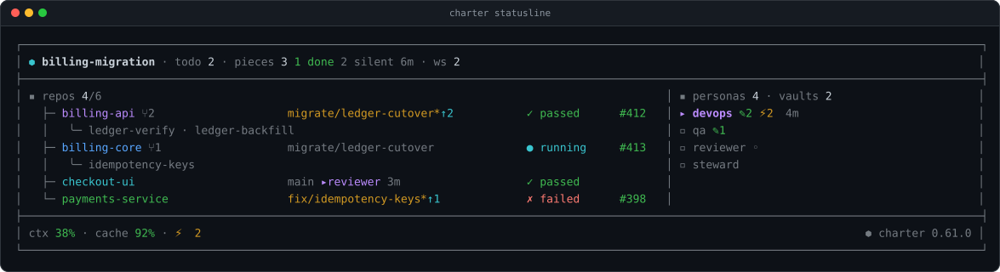
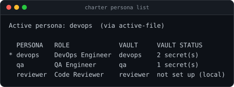
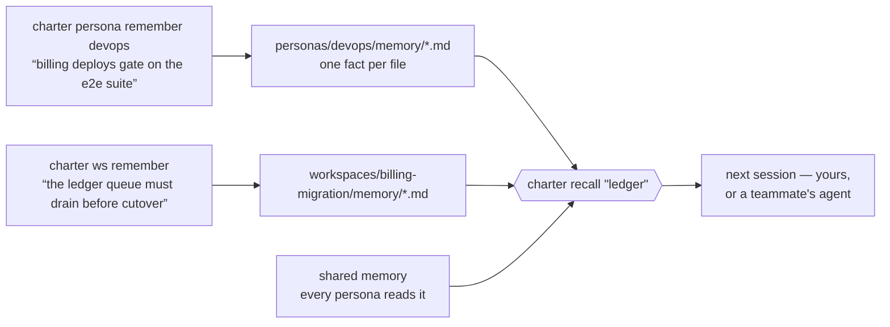
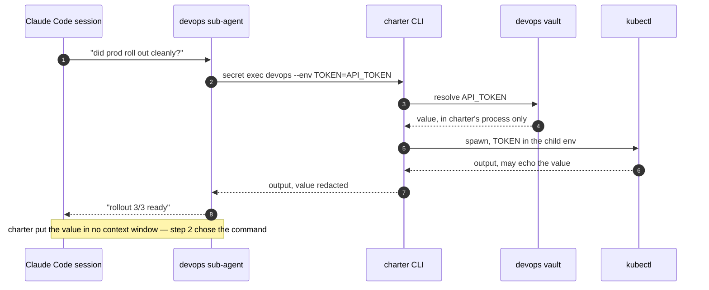

# charter

[](https://pypi.org/project/charter-cp/)
[](https://pypi.org/project/charter-cp/)
[](https://github.com/diazoxide/charter/actions/workflows/test.yml)
[](LICENSE)

**Your agent forgets everything, holds every credential, and works in one checkout.**



charter is a control plane for coding agents working across many repos on GitHub or
GitLab: durable **personas**, isolated per-task **workspaces**, and a credential **vault**
the model never reads from. It runs inside **Claude Code, opencode and Codex**, enforcing
the same rules in each.

That image is the status line under Claude Code, redrawn from disk every turn — the task
you're on, the repos it owns and what branch each is sitting on, which are dirty or
unpushed, CI and open PRs, and the roles you can hand work to. No git subprocess and no
network on the render path. It is generated, not mocked: `docs/assets/` holds the script
that produced it. On a harness with no status bar, `charter statusline --watch` puts the
same render in any spare terminal.

## 60 seconds



```bash
uv tool install charter-cp                        # the CLI  — one per machine, for your terminal
claude plugin marketplace add diazoxide/charter   # Claude Code's plugin — one per project, and it carries the version
claude plugin install charter@charter

mkdir my-control-plane && cd my-control-plane
charter init --forge github --owner my-org
charter doctor
charter discover
charter clone some-repo
```

**Two artifacts, and you want both.** The CLI is a single machine-global install — what you
type in your own terminal, and what CI or a cron job runs. The plugin is installed **per
project**, out of a cache Claude Code keeps holding every version at once, which is why a
*plane's* pinned version is the plugin's and not the binary's: two planes on one laptop can
sit on different charters without fighting. A CLI-only install leaves the plugin's hooks
inert, and the plugin ships no Python of its own — every hook it declares shells out to the
CLI. The plugin loads on the **next** session, so restart after installing it.
→ **[docs/install.md](docs/install.md)**

- **`charter init`** scaffolds `charter.toml`, the baseline directories (`personas/`,
  `inventory/`, `workspaces/`), a `.gitignore` tuned for the layout, and the status line
  above. Additive and idempotent — re-running it is always safe. It converts *the directory
  it runs in* into a control plane, so run it somewhere you mean to.
- **`charter doctor`** preflights python, git, git identity, the forge CLI and its auth,
  and names what's missing before anything else trips over it.
- **`charter discover`** queries the forge and writes `inventory/repos.json` — the tracked
  map of every repo in the org, complete even when nothing is cloned yet.
- **`charter clone <repo>`** clones on demand into the active workspace, already carrying
  the one-credential git policy below.

## You don't need charter if

- You work in **one repo**, on **one task at a time**.
- Your agent touches **no credential** you'd mind seeing in a transcript.
- Nothing it works out in a session is worth having **next week**.

Any one of those and this is overhead. If two or three of them made you wince, keep
reading — each section below is a failure that happened often enough to get built around.

---

## Dozens of repos, several tasks in flight, one checkout

A team's work doesn't sit in one repository, and an engineer rarely has one task open. Two
features and a hotfix means three sets of branches across a shifting set of repos, and if
they share a checkout you spend the day stashing.


A **workspace** is one directory of clones per task (`workspaces/<task>/<repo>`), each repo
on its own branch. Moving between tasks is `charter workspace use <name>` and nothing
follows you across — no stash, no context bleed, no half-applied branch from yesterday.

**Two sub-agents that need the same repo** is the case that breaks everything else.
Cloning it twice wastes the disk and they still collide. A **worktree** splits one clone
into several checkouts (`.worktrees/<repo>/<piece>`), a branch each, so the pieces
genuinely run at the same time. `charter worktree remove` refuses if it would drop
uncommitted or unpushed work.

**A workspace carries its own intent.** Claude Code's task list dies with the session;
`charter ws todo` records what the task still means to do, and each workspace holds a
one-line **Vision** that a fork inherits.

**And it travels.** `charter workspace snapshot` writes repos and branches into a committed
manifest, `restore` rebuilds the whole thing on another machine, and `fork` copies a
workspace's charter, manifest and memory. A workspace marked **LIVE**
(`charter workspace live`) commits its manifest and memory, so several engineers can work
the same task and share what each session learned. Workspaces are `local` — fully private,
nothing committed — until you say otherwise.

**Its own repo, or yours.** A control plane is any directory holding `charter.toml`, so it
can be a dedicated repo — a monorepo *for* your polyrepo — or `charter init` inside the
monorepo you already have, which offers to clone that repo into `workspaces/default/`.
Either way work happens in the workspace clones, **never in the plane root**: two sessions
sharing one working tree thrash each other's branches, so the status line and `doctor` warn
when the plane root is dirty or off its default branch.
→ [docs/workspaces.md](docs/workspaces.md)

---

## One agent holding every credential and every context

A single agent carrying every token, every convention and every repo's history is both a
security problem and a quality one — it has access it doesn't need for the task in front of
it, and a context full of things that don't apply.



A **persona** is a small named scope with its own charter, its own committed memory, its own
vault, and a `delegate-when` line saying what should be handed to it. `charter persona
sync-agents` turns each one into a real Claude Code sub-agent, so dispatching a role is
ordinary delegation rather than a prompt trick. A persona whose `mcp.json` hands a vault
value to a server names the destination it would reach and waits for `--approve-mcp`, which
asks about each server after showing it. What gets recorded is a digest of the line you
read — which names every key of the entry and the vault it would spend, not just the
server's name — so a teammate re-pointing any of it lapses the approval rather than
inheriting it.

They compose the way people do: `extends:` inherits a parent's charter, `uses:` says this
role routes work to that one, and `agent-tools` narrows what the generated sub-agent may
touch. They are committed files, so a persona is a team artifact — your `reviewer` is your
teammate's `reviewer`.
→ [docs/personas.md](docs/personas.md)

---

## You are always teaching the agent the same things

`CLAUDE.md` holds what you sat down and wrote. It doesn't hold what the agent worked out at
2am — that the flaky checkout test is a DNS timeout rather than the code, that billing
deploys gate on the e2e suite and not the unit ones. That knowledge dies with the session,
so next week you explain it again or watch it get rediscovered the slow way.



Memory has three dimensions and they do different jobs: **a persona's own** (what this role
knows), **shared** (what every role should know), and **the workspace's** (what this task
established). One fact per markdown file.

`charter recall` searches all three in a single pass — by keyword, or with `--since 2w` and
`--all-workspaces` for when you remember roughly *when* something was decided but not where
or in what words. They are ordinary files, so how far a note travels — disk only,
committed, or pushed to the team — is one setting, `[memory].share`, and it defaults to
`local`.

---

## Credentials that end up in the transcript

The moment an agent reads a token, that token is in the context window — and from there in
the transcript, the logs, and any summary fed into a later prompt. A **vault** hands the
value to a *command* instead of to the model:



Reads are masked by default, `--reveal` refuses a non-interactive stdout, and the plugin's
guard denies that flag and known reader programs whose argument spells out a vault path.
Those close the accidental paths; they are not a boundary against a command chosen on
purpose — a glob, a shell variable or an unlisted program walks past, by design and not by
oversight — see [SECURITY.md](SECURITY.md).

**Vaults are pluggable, and the provider is where the storage guarantee comes from.** Three
ship today — `plain_file`, `reference` (point at a value that lives elsewhere) and
**`1password`** — and more are coming. Read [docs/secrets.md](docs/secrets.md) before
storing anything real: **`plain_file` is plaintext at mode 0600, with no encryption at
rest.** What every provider buys you is the same and it is the point — on the paths that
consume it (`secret exec`, `--dotenv`, MCP) ***charter never prints the value into the
conversation, and everywhere else prints it only where you asked for it yourself***. What
the command you hand it to does with it is that command's business — and `secret get
--reveal` prints to your terminal, while `secret cp` writes a real file it creates and
refuses any destination that turns out to be one of charter's own streams, `/dev/stdout`
included ([#449](https://github.com/diazoxide/charter/pull/449)). What only a real
backend buys you is encryption. The vault is not a password manager; 1Password is, and charter will read from it.

**A browser login: charter hands Playwright the password by name, so nobody types it into
the conversation.** `charter browser install` generates *Playwright's own* driving pages
into the plane (`.claude/skills/playwright-cli/`) — charter vendors none of them, so a
Playwright fix doesn't wait on a charter release. What charter ships is the two halves
Playwright doesn't: the **credential bridge** (`charter secret exec --dotenv` resolves vault keys into one 0600
temp file and points `PLAYWRIGHT_MCP_SECRETS_FILE` at it, so you refer to a password *by
name* and Playwright substitutes and redacts it), and **per-worker session isolation**
(`-s=<name>` gives each worker independent cookies, localStorage, IndexedDB and tabs — so
N agents are logged in as N different users at once).

---

## Seeing what every agent is actually doing

The status line at the top of this page is the whole point: one render, from disk, every
turn. The active task and its open todos, every cloned repo with its branch, dirty and
unpushed markers, CI status and open PRs pulled from each clone's own forge, and the
personas with their vault and memory state.

**Who is in which tree.** A repo or worktree row says which persona was last seen working
in it and how long ago — `▸steward now`, `▸forge 7m +1`. An observation with an age, never
a claim that anyone is still there. A piece that has said nothing for a while shows as
exactly that: **silence, with an age**, because a worker that dies declares nothing.

**Whether your roster is real.** `charter persona stats` reports each role's memory count,
recency, a quality proxy, and how many times it was actually **dispatched** as a sub-agent
— so you can see whether a persona is doing work or whether that work is quietly routing to
a generic agent. `charter persona lint` catches dangling `uses:`, missing `delegate-when`,
and stale generated agents.

**What the guards did.** `charter trace` shows guard denials, tool approvals, secret
warnings and memory writes for the session. `charter doctor` preflights the lot.

---

## No database, no server, no daemon

Git is the state. Personas, memories, todos, manifests, inventory and config are ordinary
committed files in ordinary git repos — which is why a teammate's agent can start where
yours left off, why `git log` is the audit trail, and why there is nothing to deploy,
migrate or back up separately.

The wheel has **zero Python dependencies** (`dependencies = []`). What charter does need is
what you already have: Python ≥3.11, `git`, and `gh` or `glab` authenticated for the forge
you use. The browser lane additionally shells out to `npx`. That is the whole list —
`charter doctor` checks every item of it and names what's missing.

---

## The model

- **Control plane** — any directory marked by `charter.toml`. Not a fixed location: `cd`
  anywhere beneath one and commands resolve it by walking up, the way git resolves `.git`.
- **Workspace** — an isolated, per-task directory of repo clones (`workspaces/<name>/<repo>`).
  `default` always exists; `charter workspace create <name> --use` starts a new one.
- **Worktree** — a further split *within* one workspace's clone
  (`workspaces/<ws>/.worktrees/<repo>/<piece>`), so parallel sub-agents each get their own
  branch of the *same* repo without re-cloning it.
- **Piece** — one worktree seen as a unit of work. Creating it *is* the claim, because git
  already arbitrates who wins the path; the worker later declares `done` or `abandoned`.
  There is deliberately no `failed` or `blocked` — a worker that dies declares nothing, and
  that **silence**, with an age, is what gets reported.
  → [ADR 0011](docs/adr/0011-the-record-holds-only-what-git-cannot-know.md)
- **Persona** — a specialist role identity with a committed charter, persistent memory, and
  a named vault — dispatchable as an isolated Claude Code sub-agent. charter's
  differentiator; see [docs/personas.md](docs/personas.md).
- **Memory** — durable notes a persona or workspace records as it works. How far a note
  travels — disk only, committed, or pushed to the team — is one setting, `[memory].share`,
  and it **defaults to `local`**.
- **Vault** — where a persona's credentials live. The provider decides the storage
  guarantee; the boundary is the same for all of them, and it is that **charter never puts
  the value in an agent's context or transcript on the paths that consume it** —
  `secret exec`, `--dotenv`, MCP — while `secret get --reveal` prints it to your terminal
  and `secret cp <dest>` writes it to a real file you named. The command charter hands it
  to still can.

## Also in the box

- **Three harnesses, one set of rules.** charter runs inside `claude-code`, `opencode` and
  `codex` — the names `$CHARTER_HARNESS` holds — and enforces the same invariants in each:
  the plane-root guard, the one-credential rule, the secret-leak check, the persona's
  declared tools, and the containment rule — **a name charter reads out of a committed file
  cannot choose what it runs, what it reads, or where it writes**. Personas, manifests,
  memory and the inventory are meant to be committed and shared, which is exactly what makes
  them untrusted input: they arrive from someone else's machine. What differs is not what charter enforces but what each harness *lets*
  charter offer, and `charter harness list` prints that gap rather than leaving you to find
  it. Neither `opencode` nor `codex` has a status bar charter can render into, which is what
  `charter statusline --watch` is for; `codex` needs one extra command
  (`charter harness install codex`) because nothing in a plugin can tell a shell which
  harness it is.
  → [docs/harnesses.md](docs/harnesses.md)
- **A status line only one of your three harnesses has.** `charter claude` (or `codex`,
  or `opencode`) runs the harness inside a frame charter composes: the agent in the middle,
  charter's own panels on the edges — the active workspace, open todos, what wants
  attention — repainting when charter's hooks say the plane changed. tmux composes and
  owns the rectangles; charter fills the edges and never draws in the agent's own pane.
  `charter frame -- <cmd>` does it for a command charter has never met, and `--no-frame`
  (or piping the output anywhere) skips the frame entirely and carries the real exit code.
  Name the one you use — `[harness] default = "claude"` — and the command is just
  `charter`.
  → [docs/frame.md](docs/frame.md)
- **An unattended run that stops to ask a question.** Every git operation authenticates
  with that repo's own forge CLI token over HTTPS — never an SSH key, never signing —
  because a passphrase prompt hangs an agent until it times out.
  → [docs/git-policy.md](docs/git-policy.md)
- **Everyone on a slightly different charter.** `[charter].version` in `charter.toml` pins
  one version like a lockfile, measured against the **plugin** — so two planes on one laptop
  can sit on different charters, and `claude plugin update charter@charter` moves this plane
  and no other.
  → [docs/control-plane.md](docs/control-plane.md)
- **A rule you want everyone prompted for.** `charter guard ask 'terraform apply *'` writes
  a Claude Code `permissions.ask` rule into the plane's committed settings. charter keeps no
  list of its own — one record, nothing to sync.
  → [ADR 0014](docs/adr/0014-policy-that-fits-a-pattern-belongs-to-the-host.md)
- **A live browser session sitting untracked in your tree.** `charter browser install`
  gitignores `.playwright-cli/` and says that it did — a session directory is cookies, and
  cookies are the credential in another form. The generated Playwright reference beside it
  carries no credential, so charter names the cost of committing it either way and leaves
  the choice to the plane.
  → [ADR 0017](docs/adr/0017-charter-ignores-what-carries-credentials.md)
- **A tool that silently stopped existing.** After a rename removed the shim they launched
  through, MCP servers failed with ENOENT and their tools simply vanished from the session.
  `charter doctor` now names any registered launcher whose path does not exist, and the
  one-line fix.
- **A plane writing down charter's own rules, and getting them wrong later.** The plugin
  ships the skills for its surface — `charter:secrets`, `charter:working-in-a-clone`,
  `charter:persona` and `charter:browser`. They version with the CLI, so a plane no longer
  needs a copy that can drift out from under it.

## Learn more

Every page below is also readable from the CLI, so an agent working in a control plane
does not need a vendored copy that can drift from the binary it is describing:

```bash
charter docs list             # the topics
charter docs show secrets     # the page, from the install that implements it
```

`charter doctor` names a plane that has kept its own copy of one of these, or of a shipped
skill. It never tells you to delete it — an override may be deliberate — only that a local
copy wins, is compared to nothing, and drifts unwatched in both directions.

- [docs/install.md](docs/install.md) — both artifacts, alternatives to `uv`, and what
  `charter init` writes before you let it.
- [docs/control-plane.md](docs/control-plane.md) — `charter.toml` in full: every key, a
  self-hosted example, a mixed-forge example, the memory posture, the version pin.
- [docs/personas.md](docs/personas.md) — the charter format, inheritance, the memory model,
  and dispatching a persona as a sub-agent, end to end.
- [docs/workspaces.md](docs/workspaces.md) — the session lock and how to get out of it,
  LIVE vs LOCAL and where your notes actually go, and what belongs in `workspace.md`
  versus memory versus the manifest.
- [docs/secrets.md](docs/secrets.md) — exactly what the vault does and does not protect
  against, `secret exec`, and feeding a tool that wants a dotenv file.
- [docs/harnesses.md](docs/harnesses.md) — Claude Code, opencode and Codex: how each is
  wired, what each cannot carry, and the one command Codex needs.
- [docs/frame.md](docs/frame.md) — `charter claude` and the frame: what tmux it needs,
  what changes inside it (scrollback, mouse, the hotkey palette), how exit codes get out,
  what happens when the terminal is too small, and every `[frame]` setting.
- [docs/git-policy.md](docs/git-policy.md) — the one-credential rule, and why a denial from
  the plugin's guard is the rule working rather than a bug.
- [docs/hooks.md](docs/hooks.md) — everything the plugin does without being asked: what
  fires when, the five guards, what to do when one of them is wrong, what gets injected,
  and what gets counted.
- [docs/mcp.md](docs/mcp.md) — giving an MCP server a persona's vault credentials without
  the value entering the model, and what the per-persona tool allowlist does and does not
  constrain.
- [docs/forges.md](docs/forges.md) — what GitLab and GitHub each need, self-hosted hosts,
  and the rule for a repo name that collides across forges.
- [docs/changes.md](docs/changes.md) — one change spanning several repos: what the record
  holds, why it holds no state, what charter refuses to do with it, and how a revert is a
  new change rather than an undo button.

## Contributing

Issues and pull requests are welcome — see [CONTRIBUTING.md](CONTRIBUTING.md) for the dev
setup and what a good change looks like, and [SECURITY.md](SECURITY.md) for how to report
something sensitive. The test suite is stdlib `unittest`:

```bash
python3 -m unittest discover -s tests
```

MIT licensed.
