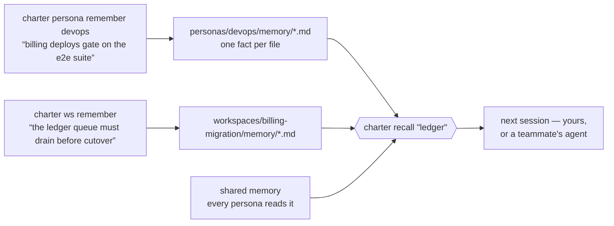
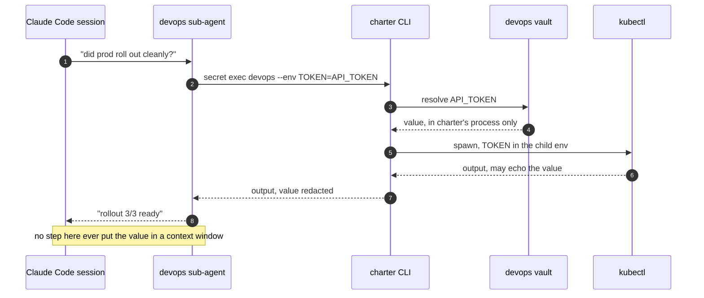

# charter

[](https://pypi.org/project/charter-cp/)
[](https://pypi.org/project/charter-cp/)
[](https://github.com/diazoxide/charter/actions/workflows/test.yml)
[](LICENSE)

**charter** is a control plane for Claude Code agents working across many repos on
GitHub or GitLab: durable **personas**, isolated per-task **workspaces**, and a
credential **vault** the model never reads from.


That is the Claude Code status line, redrawn from disk every turn — the task you're on,
the repos it owns and what branch each is sitting on, which are dirty or unpushed, CI and
open PRs, and the roles you can hand work to. No git subprocess and no network on the
render path. It is generated, not mocked: `docs/assets/` holds the script that produced it.

## 60 seconds


```bash
uv tool install charter-cp                        # the CLI  (Python ≥ 3.11)
claude plugin marketplace add diazoxide/charter   # the plugin (hooks, guard, session context)
claude plugin install charter@charter

mkdir my-control-plane && cd my-control-plane
charter init --forge github --owner my-org
charter doctor
charter discover
charter clone some-repo
```

- **`charter init`** scaffolds `charter.toml`, the baseline directories (`personas/`,
  `inventory/`, `workspaces/`), a `.gitignore` tuned for the layout, and the status line
  above. Additive and idempotent — re-running it is always safe. It converts *the directory
  it runs in* into a control plane, so run it somewhere you mean to.
- **`charter doctor`** preflights python, git, git identity, the forge CLI and its auth,
  and names what's missing before anything else trips over it.
- **`charter discover`** queries the forge and writes `inventory/repos.json` — the tracked
  map of every repo in the org, complete even when nothing is cloned yet.
- **`charter clone <repo>`** clones on demand into the active workspace, already carrying
  the one-credential git policy below.

charter ships as **two artifacts** and you want both: a CLI-only install leaves the
plugin's hooks inert, and the plugin ships no Python of its own — every hook it declares
shells out to the CLI. The plugin loads on the **next** session, so restart after
installing it. Full install notes, alternatives to `uv`, and a prompt you can paste into
Claude Code to do all of it: **[docs/install.md](docs/install.md)**.

## Why charter

Each of these is something that went wrong often enough to get built around.

### Dozens of repos, and several tasks in flight at once

A team's work doesn't sit in one repository, and an engineer rarely has one task open. Two
features and a hotfix means three sets of branches across a shifting set of repos, and if
they share a checkout you spend the day stashing. A **workspace** is one directory of
clones per task (`workspaces/<task>/<repo>`), each repo on its own branch, so moving
between tasks is `charter workspace use <name>` and nothing follows you across.

### Two sub-agents that need the same repo

Splitting a task across parallel sub-agents falls apart the moment both want the same
repository on different branches. Cloning it twice wastes the disk and they still collide.
A **worktree** splits one clone into several checkouts (`.worktrees/<repo>/<piece>`), a
branch each, so the pieces genuinely run at the same time. `charter worktree remove`
refuses if it would drop uncommitted or unpushed work.

### You are always teaching the agent the same things

`CLAUDE.md` holds what you sat down and wrote. It doesn't hold what the agent worked out at
2am — that the flaky checkout test is a DNS timeout rather than the code, that billing
deploys gate on the e2e suite and not the unit ones. That knowledge dies with the session,
so next week you explain it again or watch it get rediscovered the slow way.



One fact per markdown file. `charter recall` searches the workspace's notes, the active
role's own notes and the shared ones in a single pass — by keyword, or with `--since 2w`
and `--all-workspaces` for when you remember roughly *when* something was decided but not
where or in what words. They are ordinary committed files, so a teammate's agent can start
where yours left off.

### One agent that holds every credential and every context

A single agent carrying every token, every convention and every repo's history is both a
security problem and a quality one — it has access it doesn't need for the task in front of
it, and a context full of things that don't apply. A **persona** is a small named scope
(`devops`, `qa`, `reviewer`) with its own charter, its own committed memory, its own vault,
and a `delegate-when` line saying what should be handed to it. `charter persona
sync-agents` turns each one into a real Claude Code sub-agent, so dispatching a role is
ordinary delegation rather than a prompt trick. They compose the way people do: `extends:`
inherits a parent's charter, `uses:` says this role routes work to that one, and
`agent-tools` narrows what the generated sub-agent may touch.

### Credentials that end up in the transcript

The moment an agent reads a token, that token is in the context window — and from there in
the transcript, the logs, and any summary fed into a later prompt. A **vault** hands the
value to a *command* instead of to the model:



Reads are masked by default, `--reveal` refuses a non-interactive stdout, and the plugin's
guard denies both that flag and `cat`-ing a vault file outright. Read
**[docs/secrets.md](docs/secrets.md)** before storing anything real: the default provider
is plaintext at mode 0600, so what this buys you is *the model never seeing the value* —
not encryption at rest. The vault is not a password manager.

### Also in the box

- **An unattended run that stops to ask a question.** Every git operation authenticates
  with that repo's own forge CLI token over HTTPS — never an SSH key, never signing —
  because a passphrase prompt hangs an agent until it times out.
  → [docs/git-policy.md](docs/git-policy.md)
- **What the task still means to do.** Claude Code's task list dies with the session;
  `charter ws todo` records intent against the workspace, and each workspace carries a
  one-line **Vision** that a fork inherits.
- **Coming back cold, or handing work over.** `charter workspace snapshot` writes repos and
  branches into a committed manifest; `restore` rebuilds the whole thing on another
  machine; `fork` copies a workspace's charter, manifest and memory.
- **Everyone on a slightly different charter.** `[charter].version` in `charter.toml` pins
  one version like a lockfile, and a `SessionStart` hook conforms each machine to it.
  Opt-in, exact rather than a floor, so it downgrades too.
  → [docs/control-plane.md](docs/control-plane.md)
- **Seeing what any of it is doing.** `charter doctor` preflights, `charter trace` shows
  guard denials and tool approvals and memory writes, and `charter persona stats` says
  whether a role is actually being dispatched or whether that work is quietly routing to a
  generic agent.

## The model


- **Control plane** — any directory marked by `charter.toml`. Not a fixed location: `cd`
  anywhere beneath one and commands resolve it by walking up, the way git resolves `.git`.
- **Workspace** — an isolated, per-task directory of repo clones (`workspaces/<name>/<repo>`).
  `default` always exists; `charter workspace create <name> --use` starts a new one.
- **Worktree** — a further split *within* one workspace's clone
  (`workspaces/<ws>/.worktrees/<repo>/<piece>`), so parallel sub-agents each get their own
  branch of the *same* repo without re-cloning it.
- **Persona** — a specialist role identity with a committed charter, persistent memory, and
  a named vault — dispatchable as an isolated Claude Code sub-agent. charter's
  differentiator; see [docs/personas.md](docs/personas.md).
- **Memory** — durable notes a persona or workspace records as it works. How far a note
  travels — disk only, committed, or pushed to the team — is one setting, `[memory].share`,
  and it **defaults to `local`**.
- **Vault** — where a persona's credentials live: plaintext JSON at mode 0600, with **no
  encryption at rest**. What it protects is different and real — keeping the value out of
  an agent's context and transcript.

## Learn more

- [docs/install.md](docs/install.md) — both artifacts, alternatives to `uv`, and what
  `charter init` writes before you let it.
- [docs/control-plane.md](docs/control-plane.md) — `charter.toml` in full: every key, a
  self-hosted example, a mixed-forge example, the memory posture, the version pin.
- [docs/personas.md](docs/personas.md) — the charter format, inheritance, the memory model,
  and dispatching a persona as a sub-agent, end to end.
- [docs/secrets.md](docs/secrets.md) — exactly what the vault does and does not protect
  against, `secret exec`, and feeding a tool that wants a dotenv file.
- [docs/git-policy.md](docs/git-policy.md) — the one-credential rule, and why a denial from
  the plugin's guard is the rule working rather than a bug.
- [docs/forges.md](docs/forges.md) — what GitLab and GitHub each need, self-hosted hosts,
  and the rule for a repo name that collides across forges.

## Contributing

Issues and pull requests are welcome — see [CONTRIBUTING.md](CONTRIBUTING.md) for the dev
setup and what a good change looks like, and [SECURITY.md](SECURITY.md) for how to report
something sensitive. The test suite is stdlib `unittest`:

```bash
python3 -m unittest discover -s tests
```

MIT licensed.
